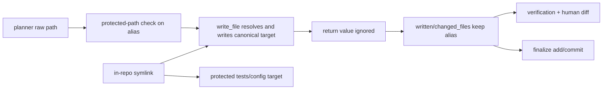
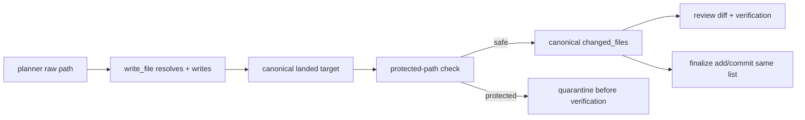
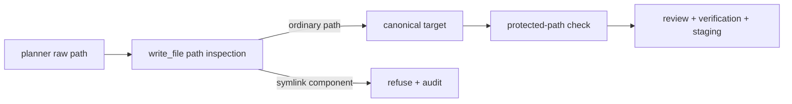

# Security Hardening Proposal: Preserve canonical landed paths through governance

## Decision

The real-repository write workflow already has a useful low-level primitive:
`RepoWorkspaceTools._validate_write_path` resolves the filesystem destination
and `write_file` returns the canonical repository-relative target. The decision
is whether the higher-level loop should consume that result or whether the
writer should refuse all symlinked targets. The current mismatch is security
relevant because protected paths exist specifically to stop model-controlled
verification and review changes.

## Executive Recommendation

I recommend **Option 1: Propagate the canonical write result**. Capture the
`write_file` result at the loop boundary, rerun protected-path policy on the
landed target, and use that same canonical list for `written`, `changed_files`,
pending diffs, verification bookkeeping, and final staging.

**Option 2: Refuse symlinked write targets** is appropriate if the agentic layer
is ever exposed to hostile multi-tenant repositories or if repository inventory
shows symlinks are not needed. It is stronger containment, but it breaks benign
symlink workflows and does not remove the need for truthful canonical
bookkeeping.

## Evidence

I inspected the writer, loop, finalization function, and regression tests. The
following map defines the IDs used in this proposal.

| Evidence | Finding or source | What it establishes |
| --- | --- | --- |
| `SB-008` | Protected-write policy loses canonical landed path | `real_repo_loop.py:924-930` ignores `write_file`'s return and records the planner alias; `finalize_real_repo_change` stages that recorded list. |
| `canonical-writer-result` | `agentic/deepagent_github/repo_workspace.py:420-538, 662-705` | The low-level writer already resolves symlink aliases, rejects `.git` destinations, and returns the actual landed target. |
| `canonical-unit-test` | `tests/test_agentic_repo_workspace.py:1256-1292` | A unit test proves a `docs/notes.md -> tests/test_x.py` alias returns `tests/test_x.py`, but it does not prove the real loop consumes the result. |
| `governance-gates` | `agentic/real_repo_loop.py:884-945, 1082-1105` | Protected-path checks happen before verification and again before staging, so a raw/canonical mismatch can hide the dangerous file from both review phases. |

## Current Design And Failure Mode

The writer's return value is the source of truth, but the caller discards it:

1. The planner proposes `docs/notes.md`.
2. A repository symlink resolves that path to `tests/test_x.py`.
3. `write_file` writes the test file and returns `{"target": "tests/test_x.py"}`.
4. `run_real_repo_loop` appends the raw `docs/notes.md` string to `written`.
5. Protected-path matching and verification metadata reason about the alias.
6. Finalization stages `changed_files`, which can include the canonical target
   after Git resolves the path, even though approval did not review that target.

The existing low-level test captures why the result matters, but the integration
boundary is still wrong. This is an inferred governance failure from observed
source behavior, not a claim that the default-disabled agentic layer is publicly
reachable. When an operator enables the real-repo loop for an untrusted PR or
model response, however, the protected-path invariant should hold by
construction.

## Desired Invariants

- One canonical landed path is used for scope checks, diffs, verification,
  audit records, `changed_files`, and final staging.
- A canonical path under `tests/`, `.github/`, `.git/`, configuration, or another
  protected prefix is rejected before verification and before any approval-side
  effect.
- Normal new-file and ordinary existing-file writes preserve current behavior.
- Pending/resumed runs cannot turn a previously recorded alias into an unchecked
  canonical target.

## Constraints And Non-Goals

We should not broaden `allow_git_write_tools`, introduce a shell, or redesign
the repository workspace primitive in this patch. The fix should work with the
current planner protocol and preserve module isolation. A complete filesystem
TOCTOU proof is a separate lower-level concern; this proposal addresses the
demonstrated integration mismatch.

## Before Architecture

The dangerous edge is `write_file -> return value ignored`: the low-level
containment check succeeds, but governance no longer knows the path that bytes
actually reached.

## Options

### Option 1: Propagate the canonical write result

Option 1 changes the loop at the exact boundary where it calls `write_file`.
The caller captures the returned target, checks it against protected prefixes,
and records only that canonical value. Pending diff rendering, verification
inputs, iteration unions, and `finalize_real_repo_change` then consume one list.
If any returned target is protected, the iteration is quarantined before
`run_verification` runs. The writer remains free to support benign symlinks,
which is the compatibility advantage.

| Change | Before | After | Security consequence | Cost |
| --- | --- | --- | --- | --- |
| Write result | Discarded | Captured and validated | Aliases cannot hide protected landed targets | Small loop change |
| Review bookkeeping | Raw planner strings | Canonical paths | Human sees the file that changed | Pending records may normalize |
| Final staging | May receive mismatched aliases | Same canonical list used in review | Approval and commit scope converge | Persisted old runs need revalidation |

The attractive part is that the low-level result and tests already exist. We
are repairing ownership rather than adding another path resolver. The principal
concern is a concurrent filesystem mutation after resolution; this option does
not pretend to solve that lower-level race, so we retain the writer's existing
no-follow and containment checks and test the integration boundary separately.

### Option 2: Refuse symlinked write targets

Option 2 makes model-authored writes fail whenever a leaf or intermediate path
component is a symlink. It removes the alias class before bytes are written and
is attractive for a future hostile multi-tenant execution model. It is also a
behavior change: repositories may intentionally use symlinked generated content,
and those writes would now require copying or a separately trusted workflow.

| Change | Before | After | Security consequence | Cost |
| --- | --- | --- | --- | --- |
| Symlink policy | Benign links allowed | All model-authored symlink paths refused | Removes static alias redirection | Compatibility break |
| Governance data | Raw alias can survive caller | Canonical path still required for ordinary paths | Stronger but not sufficient alone | Must retain canonical bookkeeping |
| Deployment model | Single trusted operator | Easier to reason about hostile worktrees | Simpler containment story | More migration/refusal handling |

Option 2 is not a substitute for Option 1's truthful bookkeeping: ordinary path
respellings and future filesystem primitives still need one canonical identity.
It should win only when the security value of eliminating symlink workflows is
worth the compatibility cost.

## Comparison

| Dimension | Option 1: propagate result | Option 2: reject symlinks |
| --- | --- | --- |
| Security | Closes demonstrated integration bypass; preserves low-level policy | Stronger against symlink aliases, with less feature compatibility |
| Performance | Neutral; reuses existing result | Neutral; adds refusal branch |
| Memory | Neutral; canonical strings replace raw strings | Neutral |
| Reliability | Improves review/staging convergence | Deterministic refusals, but more failed legitimate writes |
| Operability | Better audit and pending-diff names | Simpler rule, more operator remediation |
| Migration | Minimal protocol change; revalidate pending aliases | Requires repository inventory and workflow migration |

## Recommendation

I recommend Option 1 under the current single-operator, optional-agentic model.
It repairs the actual ownership defect with a narrow diff and preserves
legitimate symlinks. Option 2 becomes preferable if agentic writes are opened to
untrusted tenants or the project decides that symlink support is not a product
requirement.

## Evidence Coverage And Residual Risk

| Evidence | Coverage |
| --- | --- |
| `SB-008` — canonical protected-write path is dropped | Option 1 directly addresses it; Option 2 blocks the demonstrated alias shape and still needs canonical bookkeeping. |
| `canonical-writer-result` — writer already returns the landed path | Option 1 consumes the existing primitive; Option 2 adds a stricter policy on top of it. |
| `governance-gates` — checks before verification and staging | Both options preserve the existing gates; Option 1 makes their inputs identical. |

Residual risks include concurrent changes to the worktree between path
validation and write, malicious content in an otherwise permitted non-protected
file, and the trusted operator's ability to enable Git writes. Those require the
lower-level filesystem race review, content scanners, and deployment controls;
this proposal does not claim to solve them.

## Migration And Rollout

1. Add a helper that consumes and validates the `write_file` result in the loop.
2. Convert `written`, `ever_written`, iteration `changed_files`, pending diff
   inputs, and finalization inputs to canonical paths.
3. Revalidate persisted pending runs before approval; reject or re-render any
   run whose recorded alias cannot be proven canonical.
4. Roll out with agentic Git writes still disabled, run the symlink integration
   suite, then enable only after the pending-diff and audit paths show canonical
   targets.
5. Roll back by reverting the caller bookkeeping while retaining the low-level
   path resolver; do not remove the writer's canonical return value.

## Validation Plan

- Add a real loop regression with `docs/notes.md -> tests/test_x.py` that asserts
  no verification, approval, or staging occurs and the rejection names the
  canonical protected path.
- Add an ordinary new-file fixture and the existing respelling fixtures to prove
  no behavior regression.
- Assert `result.changed_files`, `ever_written`, rendered pending diffs, and
  `finalize_real_repo_change` all use the same canonical path list.
- Exercise resume/approval of a persisted alias and require revalidation.
- Run focused agentic tests, Ruff, invariant guard, and `git diff --check` in the
  implementation branch. Do not run a real GitHub push in unit tests.

## Implementation Work Packages

- Capture `tools.write_file`'s result and extract its canonical `target`.
- Run protected-path matching on canonical targets before appending `written`.
- Store canonical paths in loop results, audit/pending records, and final staging.
- Add symlink-alias and persisted-run regression coverage.
- Review all consumers of `RealRepoLoopResult.changed_files` for assumptions that
  paths are planner-spelled rather than landed.

## Open Questions

- Should a resumed run with a raw pre-fix alias be automatically re-rendered, or
  rejected for a fresh proposal?
- Should the writer expose a typed result instead of a free-form dictionary to
  make ignoring the canonical target harder for future callers?
- If the agentic layer becomes multi-tenant, should Option 2 become mandatory?
