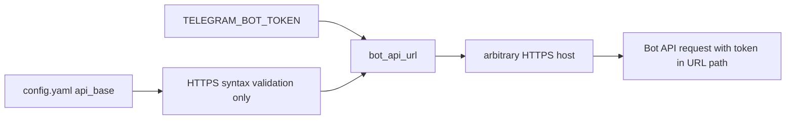
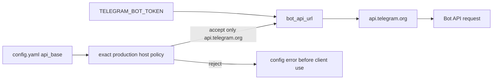
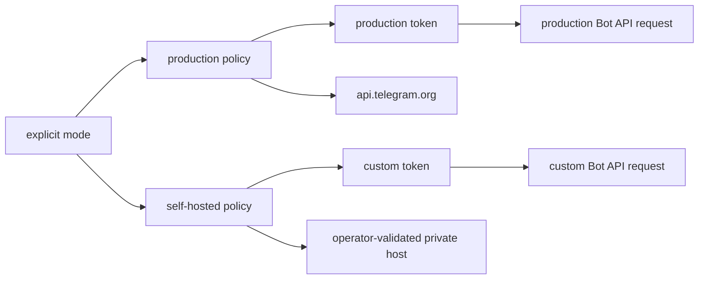

# Security Hardening Proposal: Pin Telegram Bot API endpoint identity

## Decision

We need to decide whether `telegram.api_base` is a production endpoint selector
or a supported self-hosted deployment feature. The current code treats it as any
HTTPS URL, but `telegram/client.py` puts `TELEGRAM_BOT_TOKEN` directly in that
URL. That makes endpoint identity part of the credential boundary, not merely a
transport convenience.

## Executive Recommendation

I recommend **Option 1: Pin the production endpoint** for the current product
and threat model. It rejects every host except `api.telegram.org` before the
Telegram client can be used, preserves the shipped configuration, and requires
only focused tests and documentation.

**Option 2: Explicit custom/self-hosted endpoint mode** is the stronger product
choice only if CyClaw intends to support a private Bot API deployment. It should
use a separate mode and credential source, not turn the current production token
into a bearer credential for an arbitrary configured host.

## Evidence

I inspected the configuration and every token-bearing Telegram request builder;
the conclusion is source-derived rather than a live network observation.

| Evidence | Finding or source | What it establishes |
| --- | --- | --- |
| `OPTIONAL-LAYERS-TELEGRAM-API-BASE-001` | Telegram API base is not endpoint-pinned | `telegram/config.py:257-278` accepts arbitrary HTTPS hosts, and `telegram/client.py:171-173` embeds the token under that base. |
| `telegram-config-default` | `config.yaml:958-968` | The shipped connector is disabled and points to `https://api.telegram.org`; the exposure is conditional on enabling it and influencing configuration. |
| `telegram-token-sinks` | `telegram/client.py:250-260, 462-468, 541-552, 623-639` | Send, polling, file metadata, and file-download operations all inherit the same token-bearing base. |
| `telegram-threat-model` | `docs/THREAT_MODEL.md` | Optional cloud connectors are out-of-band and operator-gated, but endpoint identity is still a useful invariant whenever a token exists. |

## Current Design And Failure Mode

`TelegramConfig.__post_init__` checks that `api_base` has HTTPS syntax, no URL
credentials, no query or fragment, and no shell metacharacters. Those checks
prevent several parsing mistakes, but they do not answer the security question:
which service is allowed to receive the token? `bot_api_url` then formats
`{api_base}/bot{token}/{method}`. As a result, a configuration-influencer can set
`api_base` to an attacker-controlled HTTPS host, enable the connector, and cause
polling or sending to disclose the token and message/file traffic. The attacker
can use the token to act as the bot.

The default-off setting is meaningful counterevidence: this is not a remote
browser-console path in the shipped configuration. It is nevertheless a real
optional-layer boundary failure because the code has no endpoint identity guard
once an operator enables the layer. The design should fail closed at the
configuration boundary rather than depend on every operator knowing that a URL
field is also a credential destination.

## Desired Invariants

- Production Telegram tokens are sent only to `api.telegram.org` over HTTPS.
- A custom/self-hosted endpoint cannot reuse the production token by accident.
- Every Telegram API method uses the same validated endpoint decision.
- Errors and audit records never contain the complete token-bearing URL.
- Disabling the connector remains a no-op and does not require a network probe.

## Constraints And Non-Goals

The change must not broaden Telegram enablement, add a proxy trust decision, or
change inbound chat allowlists, consent, or media gates. It should remain
compatible with the current CLI and environment-token model. We are not trying
to guarantee Telegram service integrity, provider-side retention, or host TLS
trust; those remain external dependencies.

## Before Architecture

The current trust boundary is:

The important edge is the direct `config.yaml -> arbitrary HTTPS host` path.
The token never passes through a host-identity policy, so URL syntax validation
does not contain the credential.

## Options

### Option 1: Pin the production endpoint

Option 1 keeps one production policy: `api_base` must normalize to
`https://api.telegram.org` (with only the documented trailing-slash handling),
and alternate hosts, ports, paths, and schemes fail with a clear
`TelegramConfigError`. The client remains structurally unchanged, which is the
attractive part: every existing request method automatically inherits the same
decision, and existing operators do not need a migration.

The cost is deliberate loss of one-step custom Bot API support. That is a
reasonable cost while the repository documents Telegram as the public Bot API
connector. If a private deployment is already in use, the failure is early and
actionable rather than a silent token leak.

| Change | Before | After | Security consequence | Cost |
| --- | --- | --- | --- | --- |
| Endpoint validation | Any HTTPS hostname | Exact `api.telegram.org` policy | Removes attacker-controlled token destination | Custom hosts fail at startup |
| Request construction | Token-bearing URL under configured host | Same client, only validated host | All methods inherit one decision | No extra request hop |
| Diagnostics | Generic URL validation | Explicit endpoint refusal | Easier incident triage | One new operator-facing error |

The control is intentionally local. We do not need a proxy or a new service, and
we do not add a second copy of the token. The main uncertainty is product intent:
if private Bot API hosting is a supported requirement, Option 2 is a better
contract than silently rejecting it.

### Option 2: Explicit custom/self-hosted endpoint mode

Option 2 adds a named deployment mode. Production mode pins the host and reads a
production token variable; self-hosted mode requires a separate custom endpoint,
a separate token variable, and an explicit operator acknowledgement. The
Telegram client receives a validated endpoint object rather than an arbitrary
string. This gives private deployments a safe place to exist and makes token
scope visible in configuration review.

The appealing part is operational clarity for organizations that really run a
Bot API proxy. What gives me pause is the migration surface: two token lifecycles,
two endpoint policies, and more documentation create more ways to select the
wrong credential. We should not pay that complexity without evidence that
self-hosted Bot API support is needed.

| Change | Before | After | Security consequence | Cost |
| --- | --- | --- | --- | --- |
| Endpoint intent | One free-form URL | Production vs self-hosted mode | Prevents accidental production-token reuse | New config/CLI contract |
| Credential scope | One token variable | Separate token sources | Limits blast radius of a custom endpoint | Token migration and rotation |
| Request boundary | String URL assembled at call sites | Validated endpoint object | Centralizes host policy | More types and fixtures |

Option 2 is not a reason to allow arbitrary hosts in production mode. It wins
only if the maintainers accept the operational burden and can document how a
self-hosted endpoint is authenticated and monitored.

## Comparison

| Dimension | Option 1: pinned production | Option 2: explicit custom mode |
| --- | --- | --- |
| Security | High improvement for shipped deployment; no arbitrary token destination | High improvement plus scoped custom deployments |
| Performance | Neutral; validation at startup | Neutral request path, slightly more config selection |
| Memory | Neutral | Neutral to slight config-object growth |
| Reliability | Early failure for unsupported hosts | Better support for a real private endpoint, more modes to misconfigure |
| Operability | Simple and easy to audit | More explicit but more credentials and warnings |
| Migration | Minimal; shipped config remains valid | Requires custom-deployment migration and likely token rotation |

## Recommendation

I recommend Option 1 now. It is proportionate to the observed source-to-sink
path and the current configuration. Option 2 should win when a maintained
self-hosted Bot API deployment is a deliberate product requirement, with its
own credential, tests, and runbook.

## Evidence Coverage And Residual Risk

| Evidence | Coverage |
| --- | --- |
| `OPTIONAL-LAYERS-TELEGRAM-API-BASE-001` — Telegram endpoint redirection | Option 1 addresses the arbitrary-host sink; Option 2 mitigates it while preserving a separately governed custom path. |
| `telegram-token-sinks` — all token-bearing client methods | Both options centralize validation before the shared URL builder, so send, poll, get-file, and download-file inherit the control. |

Residual risk includes compromise of the intended Telegram endpoint, provider-side
retention, and an operator who intentionally shares a production token with a
custom service. Those are not fixed by URL validation and should be documented
as deployment responsibilities.

## Migration And Rollout

1. Add the endpoint policy and tests in a focused change; do not enable Telegram
   as part of the patch.
2. Load the shipped config and every known fixture before rollout.
3. If any deployment uses a non-`api.telegram.org` host, disable Telegram until
   the operator selects and implements the custom-mode design or rotates the
   token.
4. Roll back by reverting the validator only after confirming Telegram is
   disabled or the endpoint has been reviewed; a rollback must not silently
   continue using a token at an untrusted host.

## Validation Plan

- Unit-test `TelegramConfig` acceptance of the exact shipped endpoint and
  rejection of alternate hosts, ports, paths, schemes, credentials, query, and
  fragment forms.
- Mock the HTTP transport and assert every Bot API method targets the validated
  host without logging the full URL.
- Add a regression that an invalid endpoint fails before a client or poller is
  started.
- Run the Telegram-focused test suite, Ruff on touched files, and the repository
  invariant guard. No live Telegram token or network call belongs in the test.
- Review logs and exception details for token redaction after the change.

## Implementation Work Packages

- Define the production endpoint constant and strict normalization helper in
  `telegram/config.py`.
- Apply the helper during config load and preserve the existing disabled no-op.
- Add focused config/client tests and a documentation note explaining the
  custom-mode decision.
- Verify that no caller constructs a token-bearing URL outside `telegram/client.py`.

## Open Questions

- Is a self-hosted Bot API endpoint a supported deployment target or only a local
  experiment?
- If it is supported, can it use a separate token environment variable and a
  separately audited trust anchor?
- Should an endpoint change force token rotation or require an explicit CLI
  confirmation before polling starts?
